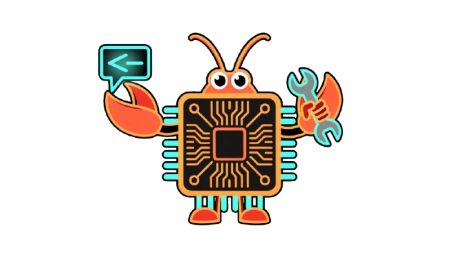

<p align="center">
  
</p>

<p align="center">
  
</p>

<p align="center">
  
  
  
  
  
</p>

<p align="center">
  
  
  
</p>

<p align="center">
  
</p>

<br />

<p align="center">
  <strong>Your infrastructure, self-healing.</strong><br />
  Not preconfigured monitoring — <em>emergent monitoring</em> that grows from real failures on your actual machine.
</p>

<p align="center">
  <em>PagerDuty costs $500/month. This is a <code>SKILL.md</code>.</em>
</p>

---

## What It Does

Dead Man's Switch turns OpenClaw into an autonomous infrastructure guardian. It monitors critical services, diagnoses failures using a priority-ordered playbook system, executes recovery procedures without human intervention, and notifies you by voice via ElevenLabs. When it encounters an error it doesn't recognize, it searches for a fix (Tavily) and writes what it learns back into its own playbooks — so it gets smarter with every incident.

---

## Architecture

```
                    ┌─────────────────────────────────┐
                    │        OpenClaw Gateway          │
                    │                                  │
                    │   gateway:startup ──► watchdog   │
                    │                         │        │
                    │         ┌───────────────┘        │
                    │         ▼                        │
                    │   dms_status (fix log audit)     │
                    │         │                        │
                    │   Recurring pattern found?       │
                    │         │                        │
                    │    Yes ─┴─ Alert user on chat    │
                    └─────────────────────────────────┘

    User: "check my services"
         │
         ▼
    SKILL: deadmans-switch
         │
         ├─► Step 1: tailscale funnel status
         │       └─► (tailnet only)? → tailscale.md playbook
         │               └─► sudo tailscale-funnel-start.sh
         │
         ├─► Step 2: curl each website
         │       └─► Non-200? → nginx.md playbook
         │               ├─► 502 → restart upstream process
         │               ├─► 503 → nginx -t && nginx reload
         │               └─► timeout → check tailscale first
         │
         ├─► Step 3: df -h /
         │       └─► >85%? → disk.md playbook
         │               └─► apt clean, journal vacuum, old logs
         │
         ├─► Step 4: Fix log audit
         │       └─► Same service 2+ times in 24h? → create cron
         │
         └─► Step 5: Notify
                 ├─► Text summary always
                 └─► ElevenLabs voice (if API key configured)
```

---

## Prerequisites

| Requirement | Details |
|-------------|---------|
|  | Linux only |
|  | ESM runtime |
|  | Must be in PATH |
|  | For recovery scripts |
|  | Gateway must be active |

**Optional but recommended:**

| Integration | Purpose |
|-------------|---------|
|  | Speaks the recovery result aloud |
|  | Self-improvement when no playbook matches |

---

## Installation

### Option A: From ClawHub (skill only)

```bash
# Install the skill (playbooks + SKILL.md)
clawhub install deadmans-switch --force
```

### Option B: From source (full plugin)

```bash
# 1. Clone the repo
git clone https://github.com/your-user/Dead-Man-s-Switch-OpenClaw-Plugin.git
cd Dead-Man-s-Switch-OpenClaw-Plugin

# 2. Install dependencies
npm install

# 3. Install recovery scripts + sudoers rules (requires sudo, idempotent)
bash install.sh

# 4. Register with OpenClaw (--link for live updates via git pull)
openclaw plugins install "$(pwd)" --link

# 5. Restart the gateway
systemctl --user restart openclaw-gateway.service

# 6. Tell your agent:
#    "check my services"
```

> `install.sh` copies scripts to `/usr/local/bin/openclaw-skills/`, writes sudoers rules,
> installs the skill to `~/.openclaw/skills/`, and creates the fix log.

---

## Configuration

Add to your `~/.openclaw/openclaw.json`. Config keys must be nested inside a
`config` sub-object under the plugin entry:

```json
{
  "plugins": {
    "entries": {
      "deadmans-switch": {
        "enabled": true,
        "config": {
          "elevenLabsApiKey": "your-elevenlabs-key",
          "tavilyApiKey": "tvly-your-tavily-key",
          "websites": [
            "https://your-site.com",
            "https://your-other-site.com"
          ],
          "services": ["tailscale", "nginx"]
        }
      }
    }
  }
}
```

| Field | Required | Description |
|-------|:--------:|-------------|
| `websites` | — | URLs to check for HTTP 200 on every run |
| `services` | — | Services to monitor (informational label) |
| `elevenLabsApiKey` | — | Enables voice alerts via ElevenLabs MCP |
| `tavilyApiKey` | — | Enables Tavily search for unknown error fixes |

---

## How It Works

### Triggered by you

Ask your OpenClaw agent:

```
"Check my services"
"Run dead man's switch"
"Is everything up?"
```

### Triggered automatically

Once Dead Man's Switch detects a recurring failure (same service failing **2+ times in 24 hours**), it suggests — and you approve — a cron job that runs every 5 minutes. **Crons are never created preemptively** — only when a real pattern is detected.

### The Fix Log

Every incident is recorded to `~/.openclaw/dms-fix-log.jsonl`:

```jsonl
{"timestamp":"2026-03-28T00:15:44Z","service":"tailscale","issue":"funnel reverted to tailnet-only","fix":"ran tailscale-funnel-start.sh","result":"success","duration_ms":3200}
{"timestamp":"2026-03-28T01:00:00Z","service":"nginx","issue":"502 on your-site.com","fix":"restarted upstream process","result":"success","duration_ms":1100}
```

The fix log is **append-only** — nothing is ever deleted. Use `dms_status` to query it.

---

## Playbooks

> Playbooks live in `skills/deadmans-switch/playbooks/` and are **living documents** —
> the agent appends new fixes after learning them via Tavily.

| Playbook | Triggers When | Key Recovery Commands |
|----------|--------------|----------------------|
| [`tailscale.md`](skills/deadmans-switch/playbooks/tailscale.md) | `(tailnet only)` in funnel status | `sudo tailscale-funnel-start.sh` |
| [`nginx.md`](skills/deadmans-switch/playbooks/nginx.md) | Non-200 HTTP, nginx errors | `nginx -t` · `nginx -s reload` · `systemctl restart nginx` |
| [`disk.md`](skills/deadmans-switch/playbooks/disk.md) | Disk ≥ 85% used | `apt-get clean` · `journalctl --vacuum` · log rotation |
| [`process.md`](skills/deadmans-switch/playbooks/process.md) | Any crashed systemd service | `systemctl restart <svc>` · `systemctl reset-failed` |

### ⚠️ Priority order matters

**Tailscale is always checked first.** If the tunnel is down, every external website returns timeouts or 502s — not because nginx is broken, but because the tunnel is broken. Diagnosing nginx first wastes time and misdiagnoses the real cause.

---

## Registered Tools

| Tool | Description |
|------|-------------|
| `dms_recover` | Execute a named recovery script · logs result automatically |
| `dms_status` | Query the fix log — last 20 incidents, per-service counts, recurring patterns |

---

## Startup Watchdog Hook

On `gateway:startup`, the watchdog reads the fix log and posts an alert in the gateway chat if any service has failed **2+ times in the last 24 hours** — along with a ready-to-run cron command. You always know what's been unstable before you start a new session.

---

## The Tailscale Bug (Real Production Context)

This plugin was built to solve a **real, recurring bug**: Tailscale Funnel randomly drops from `(Funnel on)` to `(tailnet only)`, making the OpenClaw gateway unreachable from the public internet.

**Root cause:** The systemd service started before `tailscaled` finished authenticating → `NoState` error. Fixed by moving retry logic to a dedicated script.

**What the agent does when it detects this:**

```
tailscale funnel status → "(tailnet only)" detected
→ sudo /usr/local/bin/tailscale-funnel-start.sh
→ Polls BackendState up to 30 times (3s apart)
→ tailscale funnel --bg 18789
→ Verify → Log → ElevenLabs voice alert
```

---

## Adding Custom Playbooks

1. Create `skills/deadmans-switch/playbooks/my-service.md`
2. Include: detection commands · recovery steps · logging instructions · cron rule · voice alert text
3. Add detection logic to `SKILL.md`'s diagnostic sequence
4. Drop a script in `scripts/my-service-check.sh` and re-run `install.sh`

---

## Hackathon Context

<p>
  
  
  
</p>

- **Live demo:** disconnect Tailscale on stage → agent detects → fixes → ElevenLabs voice confirms it's back
- **Pitch:** *"PagerDuty costs $500/month. This is a `SKILL.md`."*
- **Key innovation:** Emergent monitoring — configures itself from real failures, not upfront configuration

---

## License


MIT — use it, fork it, deploy it.
